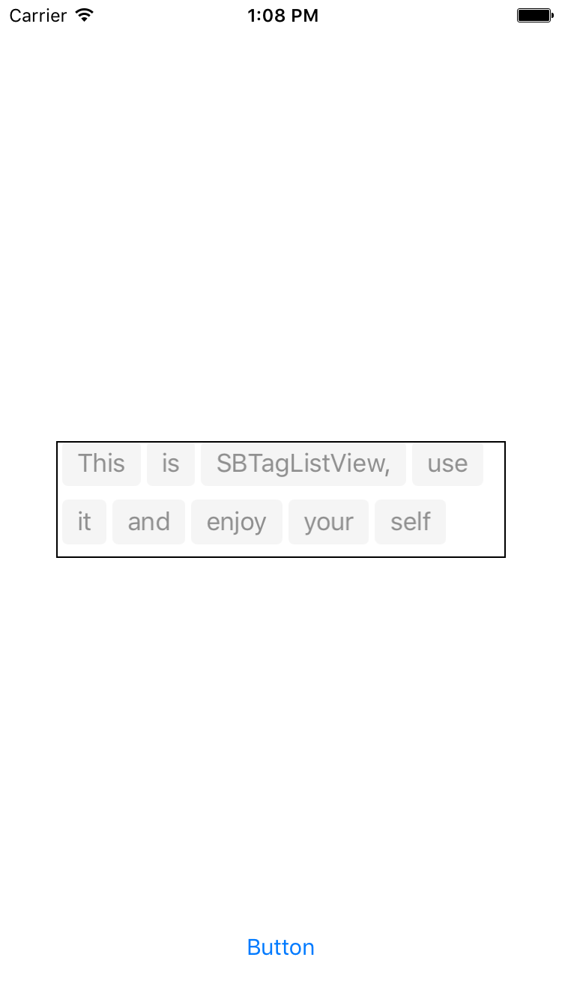

# ShanBayTagListView

#screenshot  


##install
```
drag all the '*.h/m' files in the 'Classes' path into your project
```

##usage  
* first:import header  

```
#import "SBTagListView.h"
```
* second: add protocol      

```
@interface yourviewcontroller()<SBTagListViewDelegate>  
```  
* third: alloc and init it with given width and given strings    

```
NSMutableArray *array = [NSMutableArray arrayWithArray:@[@"This",@"is",@"SBTagListView,",@"use",@"it",@"and",@"enjoy",@"your",@"self"]];
SBTagListView *list = [[SBTagListView alloc] initWithWidth:300 contentArray:array];  
```  
* then add it into your view and you'll see it  
* you need let the `list` know where the delegate is

##API reference  
* **SBTag**: instance in TagListView    
	* \- (instancetype)initWithText:(NSString *)text \---generate a SBTag by given text;  
	* \- (void)setTagType:(SBTagType)type \---now only offer 3 types:Normal,Error,Success   
  
* **SBTagListView**:  
	* property -- contentArray: store the content strings array  
	* tproperty -- agsArray: store all tags in it  
	* property -- delegate: delegate to respond to method `didSelectTagAtIndex`  
	* \- (instancetype)initWithWidth:(CGFloat)width contentArray:(NSMutableArray *)array  \--- init the taglist by given width and contentArray  
	* \- (SBTag *)desequeseTagAtIndex:(NSUInteger)index \--- get instance of tag at index  
	* \- (void)removeTagAtIndex:(NSUInteger)index \--- remove a tag at given index  
	* \- (void)resizeToWidth:(CGFloat)width \--- resize the taglist,if height is smaller than inner lines, it will expand  

* **SBTagListViewDelegate**    
	* \- (void)didSelectTagAtIndex:(NSUInteger)index  \--- interact with tag at index,you can work it with `desequeseTagAtIndex`